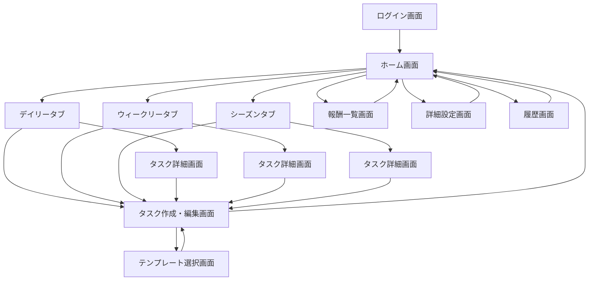

# 習慣化バトルパス 画面遷移図

## 1. 画面構成

- ログイン画面
- ホーム画面
- デイリータブ
- ウィークリータブ
- シーズンタブ
- タスク詳細画面
- タスク作成・編集画面
- テンプレート選択画面
- 報酬一覧画面
- 詳細設定画面
- 履歴画面

## 2. 画面遷移図

## 3. 遷移の補足

### 3.1 ログイン

- ログイン完了後はホーム画面へ遷移する。

### 3.2 ホーム画面

- 現在のシーズン進捗、通算レベル、シーズン内レベル、各種タブの状態を表示する。
- デイリー、ウィークリー、シーズンの各タブへ遷移できる。

### 3.3 タブ画面

- タブを開くと、対象期間のタスク一覧を表示する。
- ウィークリーとシーズンは、更新後の初回表示時に未確認バッジを表示する。
- 未確認バッジは、そのタブを最初に開いた時点で消える。
- 更新内容がある場合は、上部に簡単な説明を表示する。

### 3.4 タスク詳細画面

- タスクの進捗、回数、完了状態、報酬候補を確認できる。
- 回数タスクでは、増やすボタンと控えめな減らすボタンを表示する。
- 目標回数に達した場合は、完了ボタンを表示する。

### 3.5 タスク作成・編集画面

- 新規作成、テンプレート複製、既存タスク複製の入口を持つ。
- タスク種別に応じて経験値候補のドロップダウンを切り替える。
- 詳細設定から経験値候補を編集できる。

### 3.6 報酬一覧画面

- 通算報酬とシーズン報酬を分けて表示する。
- 報酬は手動で受け取る。

### 3.7 詳細設定画面

- 経験値候補の追加・削除・並び替えを行う。
- 編集対象は、デイリー、ウィークリー、シーズンごとに分かれている。

### 3.8 履歴画面

- 完了済みタスクを一覧できる。
- 完了済みタスクは薄く表示する。

## 4. 状態遷移のルール

- タスク完了後は、その周期の間は未完了へ戻せない。
- 同じ周期で再挑戦したい場合は、複製して新しいタスクとして作成する。
- シーズン更新時には、シーズン内レベルをリセットする。
- シーズン更新後の初回起動時に、ウィークリー・シーズンの未確認状態を付与する。
